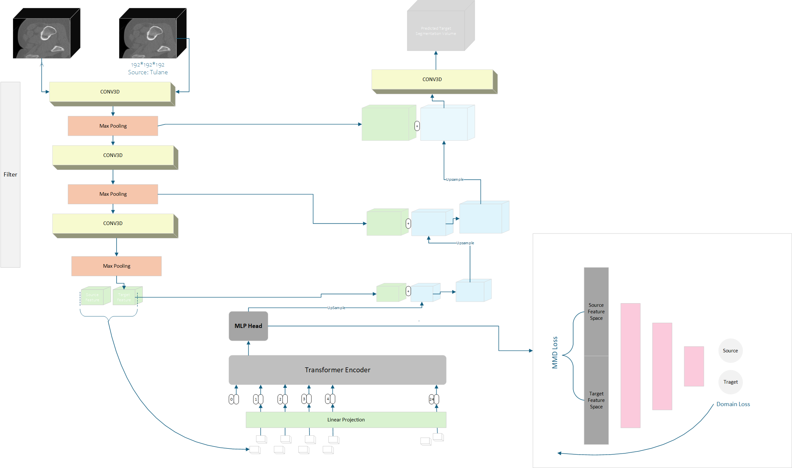
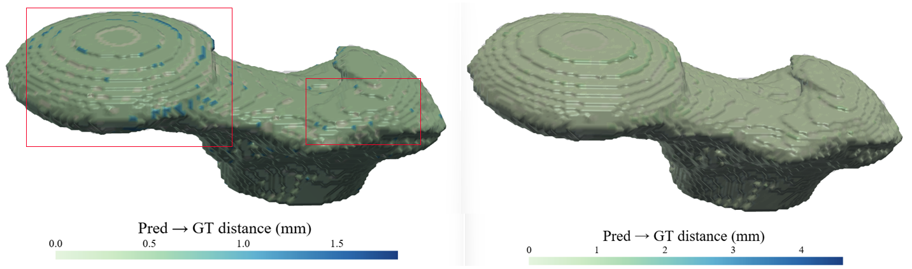
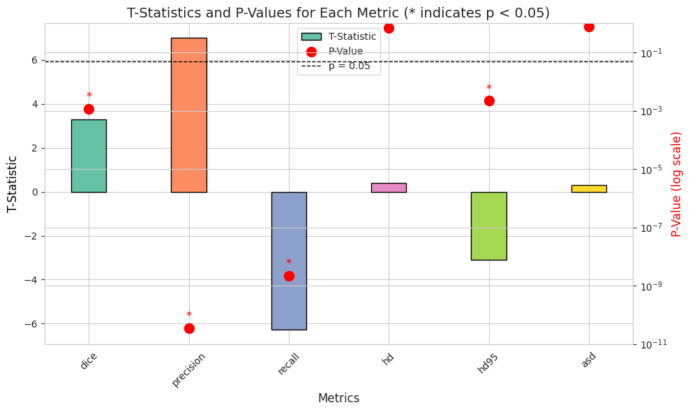

# PF-DAFormer: Proximal Femur Segmentation via Domain-Adaptive Transformer for Dual-Center QCT

Quantitative computed tomography (QCT) plays a crucial role in assessing bone strength and fracture risk by enabling volumetric analysis of bone density distribution in the proximal femur. However, deploying automated segmentation models in practice remains difficult because deep networks trained on one dataset often fail when applied to another.  
This failure stems from **domain shift**, where scanners, reconstruction settings, and patient demographics vary across institutions, leading to unstable predictions and unreliable quantitative metrics.

In this work, we developed a **domain-adaptive transformer segmentation framework** tailored for multi-institutional QCT. Our model is trained and validated on one of the largest hip fracture–related cohorts to date, comprising **1,024 Tulane University scans** and **384 Rochester scans**.  
To address domain shift, we integrate two complementary strategies within a **3D TransUNet** backbone:

- **Adversarial Alignment (GRL)** - discourages the encoder from learning scanner-specific cues.  
- **Statistical Alignment (MMD)** - explicitly reduces distributional mismatch between institutions.

This dual mechanism balances invariance and fine-grained alignment, enabling scanner-agnostic feature learning while preserving anatomical detail.

>  **Results**:  
> Dice = **99.53%**, Precision = **99.64%**, Hausdorff Distance = **0.77 mm**  
> Radiomic feature correlation with GT: **r > 0.99** (several > 0.9998)

**Preprint**: [arXiv:2510.26903](https://arxiv.org/abs/2510.26903)

## Model Overview

### Architecture  
<p align="center">
  
</p>

### Domain Adaptation Comparison  
<p align="center">
  
</p>

### Statistical Validation (t-test)  
<p align="center">
  
</p>


---

##  Installation

Make sure you have [conda](https://conda.io/projects/conda/en/latest/user-guide/install/index.html#regular-installation) installed. Then run:

```bash
git clone https://github.com/MIILab-MTU/PF-DAformer.git
cd PF-DAformer

# Create environment
conda create -n pfdaformer python=3.11.7 ipython==8.12.0 -y
conda activate pfdaformer

# Install PyTorch + CUDA 11.8
conda install pytorch==2.1.0 torchvision==0.16.0 torchaudio==2.1.0 pytorch-cuda=11.8 -c pytorch -c nvidia

# Install remaining dependencies
python -m pip install -r requirements.txt
```

> You can also use PyPI builds instead:
> ```bash
> pip install torch==2.2.2 torchvision==0.17.2 torchaudio==2.2.2 --index-url https://download.pytorch.org/whl/cu118
> pip install medpy
> ```

---

##  Data Structure

```
PF-DAformer/
│
├── data/
│   ├── tulane_qct/
│   │   └── preprocessed_training_data/
│   │       ├── MM130001/
│   │       │   ├── MM130001_modalities.pt
│   │       │   └── MM130001_label.pt
│   │       ├── MM130002/
│   │       └── ...
│   │
│   └── uci_qct/
│       └── preprocessed_training_data/
│           ├── BH6002/
│           │   ├── BH6002_modalities.pt
│           │   └── BH6002_label.pt
│           ├── BH6003/
│           └── ...

```

---

##  Dataset Preparation

### 1️Preprocessing

Use `convert_data_trans.py` to standardize and convert `.npy` volumes into the **Standarad Data structure**:

```python
root_dir = "data_tulane_converted"
output_dir = "HOMEDIR/data/tulane_qct/preprocessed_training_data/"
```

Each case will be stored as:
```
case_id/
 ├── case_id_modalities.pt
 └── case_id_label.pt
```
where each tensor has shape `(1, 192, 192, 192)`.

Run:
```bash
python convert_data_trans.py
```

---

### 2️⃣ Train-Validation Split

Use `split_csv_trans.py` to generate training and validation CSVs:

```bash
python split_csv_trans.py
```

This creates:
```
train.csv
validation.csv
```
Each CSV contains:
| data_path | case_name |
|------------|------------|
| ../../../data/tulane_qct/preprocessed_training_data/BH6002 | BH6002 |

---

## 🚀 Run Your Experiment

To launch an experiment, use the provided template under:
```
HOMEDIR/experiments/exp0/template_experiment/
```

You can duplicate and rename the folder for your study.  
Then run on a single GPU:

```bash
cd HOMEDIR
cd .experiments/exp0/template_experiment/

# default GPU: cuda:0
accelerate launch --config_file ./gpu_accelerate.yaml run_experiment.py()
```

You can modify the GPU device by changing the line in `gpu_accelerate.yaml`:
```yaml
gpu_ids: '1'   # runs on cuda:1
```

Hyperparameters such as batch size, learning rate, and weight decay can be edited in `config.yaml`.

---

## Citation

If you use this repository or build upon it, please cite:

```bibtex
@misc{dhakal2025pfdaformerproximalfemursegmentation,
  title        = {PF-DAformer: Proximal Femur Segmentation via Domain Adaptive Transformer for Dual-Center QCT},
  author       = {Rochak Dhakal and Chen Zhao and Zixin Shi and Joyce H. Keyak and Tadashi S. Kaneko and Kuan-Jui Su and Hui Shen and Hong-Wen Deng and Weihua Zhou},
  year         = {2025},
  eprint       = {2510.26903},
  archivePrefix= {arXiv},
  primaryClass = {cs.CV},
  url          = {https://arxiv.org/abs/2510.26903}
}
```
